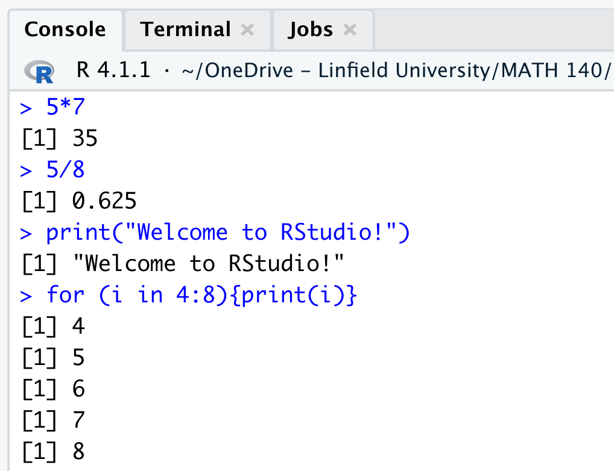
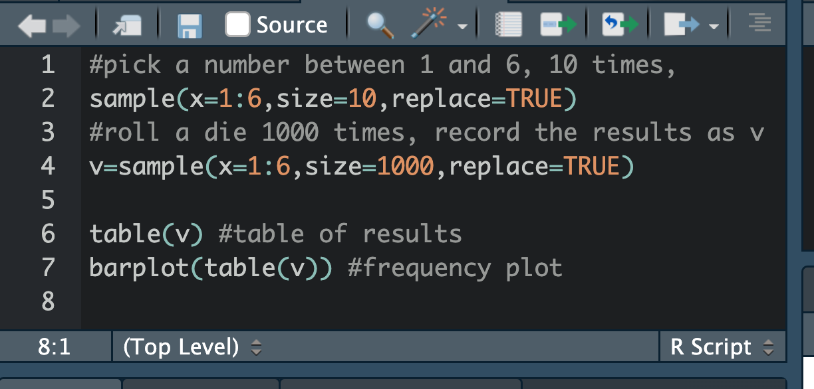

```{=html}
<style type=text/css>
blockquote {
    background: #f8f8f8;
    padding: 5px 10px;
    margin: 0 0 10px;
    font-size: 16px;
    border-left: 1px solid #aaa;
    border-bottom: 1px solid #aaa;
}
</style>
```


## 1. Install R and RStudio  

You will first need to download and install both R and RStudio (Desktop version) on your computer. R and RStudio are separate installations.  R is a programming language that is convenient to use in statistics. RStudio is a user-friendly interface that makes using R easier.  In the well-written, freely available text <a href="https://moderndive.netlify.app/">*ModernDive*</a>, the authors put it this way: 

> R is like a car’s engine while RStudio is like a car’s dashboard... So just as the way of having access to a speedometer, rearview mirrors, and a navigation system makes driving much easier, using RStudio’s interface makes using R much easier as well.

The following installation instructions are taken from  <a href="https://moderndive.netlify.app/1-getting-started.html#installing">Section 1.1.1</a> of *ModernDive*.


> 1. **You must do this first**: Download and install R by going to <a href="https://cloud.r-project.org/">https://cloud.r-project.org</a>
    - If you are a Windows user: Click on “Download R for Windows”, then click on “base”, then click on the Download link.
    - If you are macOS user: Click on “Download R for (Mac) OS X”, then under “Latest release:” click on R-X.X.X.pkg, where R-X.X.X is the version number. 
    - If you are a Linux user: Click on “Download R for Linux” and choose your distribution for more information on installing R for your setup.
2. **You must do this second**: Download and install RStudio at <a href="https://www.rstudio.com/products/rstudio/download/">https://www.rstudio.com/products/rstudio/download/</a>.
    - Scroll down to “Installers for Supported Platforms” near the bottom of the page.
    - Click on the download link corresponding to your computer’s operating system.

I recommend reading all of section 1.1.1 in *ModernDive* as you get started with RStudio.

## 2. Orient yourself in RStudio

The RStudio interface has four window panes which split your window into four quarters (the red division lines appearing in the image below were added for dramatic effect)


<center>{width=95%}</center>


Here's a quick introduction to each of these panes.

**Upper Left: Source Editor**  
The source editor pane appears in the upper left of your RStudio window. If you open RStudio files such as *scripts* or *Rmarkdown* files, they will appear in this pane.  We discuss these two types of files below, for now think of them as files we create in order to do some job for us, perhaps run a simulation, or do a statistical analysis on a data matrix, or write a lab report for this class.  In the screenshot above, the source pane has one script loaded, called *governors.R*, which has code to import data on the 50 US governors and do some exploratory data analysis.

**Lower Left: Console**   
The console pane appears in the lower left.  This pane has a command line prompt `>` at which we can enter and run code.  We can use RStudio as a calculator, we can ask it to print statements, and we can do some programming, and other cool things:

<center>{width=45%}</center>

**Upper Right: Workspace Browser**   
The workspace browser pane appears in the upper right.  This pane has several tabs.  The two we will use most are probably these:

  - *Environment tab*.  This tab displays all the data frames and variables and functions that you've defined by name in your RStudio session.
  - *History tab*.  This tab records all the commands you've run.  This history can be helpful if you're wondering how you did a certain thing a while back... .
You can *clear* your workspace browser by clicking on the broom icon near the upper right corner of the workspace browser pane.  

In the screenshot above, the Environment tab is showing in the Workspace.  It shows two defined items (defined in the script), a dataframe called `gov`, and a vector called `party_colors`, used to choose the red and blue colors appearing in plots.  The data frame `gov` has has 50 rows (observations), one for each state, and 11 columns (variables), containing information like the governor's name, age at inauguration, political party.  

**Lower Right: Plots and Files** 
The bottom right pane in RStudio has several much-used tabs.

  - The *Files tab* shows the file system in your computer.  
  - The *Plots tab* is where your beautiful graphics will appear when you create them in a script or at the console prompt.  
  - The *Help tab* is self-explanatory.  I will add that R has wonderfully rich help documentation.  If you want to learn more about a command or a built-in data set, the help tab is there - and there are usually built-in examples to demonstrate ideas.  I will also say that RStudio help is at your fingertips via Google.
  - The *Packages tab* is in this pane as well.  We talk about packages below.

In the screenshot the Plots tab is open, showing side-by-side boxplots of Governor ages by political party.  Incidentally, the code for producing this plot is visible in the Source pane of this screenshot.

## 3. Use a Folder System

Organize a folder system on your computer to help you keep track of your files and data sets.  Here's my suggestion:
  
  1. *Create a folder* dedicated to this class on your computer, perhaps the desktop, with a descriptive name, say "math140".  
 
  2. *Create a subfolder* in your "math140" folder for each RStudio project you work on. For instance, you might create a folder called "lab1" in your "math140" folder ahead of our first lab.

## 4. Create Projects 

Project files in Rstudio help you organize your work, and make it convenient for you to load different files associated with different projects into an RStudio session.
By the end of the term your "math140" folder may have 5 or 6 different subfolders.  One for each lab, one for your term project, one for top secret data analysis - who knows.  If you attach a project file to each of these subfolders then it is easy in RStudio to shift between these projects.  

To create a project, follow these steps:
  
  1. Open RStudio
  
  2. Create a project from the File menu (*File -> New Project*), or by moving the cursor to the upper-right corner of your RStudio window and selecting *Project > New Project*. 
<!-- as pictured: <center>{width=65%}</center>-->
  
  3. Select *Existing Directory* in the pop-up menu.
  
  4. Click *Browse* and navigate to where you created the lab1 folder. Select this folder and then click *Create Project*.
  
- Your R project has now been created. Note that in the upper right-hand corner, the program indicates that you are working on the project named lab1. In the future you can click on this spot in the upper right corner to change the project you want to work on or create a new one.
  
- Note also that if you click on the **Files** tab in the lower right pane in RStudio, you can access the file system on your computer.  By default, RStudio will show the contents of your current project folder
  
- In addition to the project file itself, my mature project folders often contain three types of files: 
  - R script files (discussed below)
  - data files (usually .csv files) 
  - output files (.pdf files, images of graphs, .html files (webpages))
  
## 5. Scripts 

Think of a script as a place to write down commands you want to use in a project. You can also type comments (begin a line with a pound sign #) to help your future self or a project partner understand the commands that follow.  To create a script, you can follow *File -> New File -> R Script*, or, even faster, go to the upper left corner of your RStudio window and click on the green + symbol. Then select R script.

<!--
<center>{width=65%}</center>
-->

As already mentioned, scripts are a place to write down commands you want to use in your work.  
*To execute lines of code in your script*, place your cursor anywhere on that line of code and click *Run*.

Alternatively, you can use a keyboard shortcut:

  - *Command + return* on a Mac
  - *ctrl + enter* on a PC
  
## 6. Read local csv files 

To import a .csv file that is saved locally on your computer, use the command `read.csv("path to file/filename")`

The 'path to file' part of this command is necessary if the file you want is not in your RStudio *working directory.*  You can set your working directory to a particular folder by going to the *Files tab* in the lower right pane, navigating to the folder you want, then clicking on *More* and selecting *Set as Working Directory*.

It's simplest for me to save local data files in the same folder as the scripts I write to analyze them, and then in RStudio make that folder the working directory when I'm working on them. 

For instance, suppose in a folder called "awesome" I have a script file called *legos.R*, and I also have a data file called *legosets.csv*.  If I set my working directory in RStudio to the awesome folder, then the following line in my *legos.R* script will read the data file into my RStudio session, and give it the working name 'legos':

```
legos = read.csv("legosets.csv")
```


## 7. Read csv files from the web 

To import a .csv file directly from the web into RStudio we use the following command:

`read.csv("web address")`


For instance, to import the governors data file from our resource page, and give it the name `gov`, we enter the following at the console prompt in RStudio (you can copy and paste!):

```
gov = read.csv("https://mphitchman.com/stats/data/governors.csv")
```


## 8. Packages 

RStudio comes with many built-in functions, but packages provide are bundles of extra functions we might want to use. Here is a link to a very nice  <a href="https://moderndive.netlify.app/1-getting-started.html#packages">introduction to packages</a> in *ModernDive*. I recommend you read all of Section 1.3 in this link.

You can install a package from the console prompt by running:

```
install.packages("package name")
```

You can also install a package by following these steps:

(i) Click on the **Packages** tab in the lower right pane of your RStudio session.
(ii) Click on **Install** next to **Update**
(iii) Enter the name(s) of the package(s) in the window that pops up
(iv) Click **install**

Once a package is installed in your copy of RStudio, you can load it into a current session with the `library()` command.  For instance, the ggplot2 package, used for data visualization, can be loaded into a session by executing this command:

```
library("ggplot2")
```

If you get an error when you run this command, it means the ggplot2 package hasn't been installed.

> Note: You only need to **install** the packages once, but you will need to **load** the packages each time you use RStudio.

Commonly used packages worth installing on your machine:

1. ggplot2 (for making nice plots)
2. dplyr (for managing data frames)
3. knitr (for compiling markdown files)
4. tidyverse (An opinionated collection of R packages, per <a href="https://www.tidyverse.org/">tidyverse.org</a>)
5. openintro (for data sets that appear in our text!)

## 9 Some RStudio tutorials

Tutorials made for this class:

  - <a href="Rlabs/getting-started.html">Reading Data and Descriptic Statistics</a> 
  - <a href="Rlabs/tutorial-ggplot.html">Using ggplot for sharp looking graphics</a>
  - <a href="Rlabs/tutorial-regression-planets.html">Linear Regression</a>

Note: A wealth of examples is at your fingertips via Google.  If you want to know how to do something in RStudio, like a histogram or a scatter plot, or a five number summary, or... whatever... you'll find answers quickly via Google. 
  


## 10. R Markdown 

Reports and papers can be written using R Markdown, including your term project.  R Markdown files allow you to knit together text, mathematics formatting, R code, and images into a fine looking report. 

Here is a nice website with <a href="https://rmarkdown.rstudio.com/authoring_basics.html">R Markdown Basics</a>, that demonstrates how to format text (e.g., bold, italics), make lists, make tables, insert images, insert web links, and other sorts of things in a markdown file.


## 11 References

1. <a href="https://moderndive.netlify.app/">*ModernDive*</a>

2. <a href="https://nulib.github.io/kuyper-stat202/index.html#working-efficiently-with-rstudio">Setting up R and R Studio efficiently</a>

3. <a href="https://rmarkdown.rstudio.com/authoring_basics.html">R Markdown Basics</a>


<!-- Default Statcounter code for math 140 resources pages-->
<script type="text/javascript">
var sc_project=12608389;
var sc_invisible=1;
var sc_security="1d868be4";
</script>
<script type="text/javascript"
src="https://www.statcounter.com/counter/counter.js"
async></script>
<noscript><div class="statcounter"><a title="Web Analytics"
href="https://statcounter.com/" target="_blank"></a></div></noscript>
<!-- End of Statcounter Code -->


